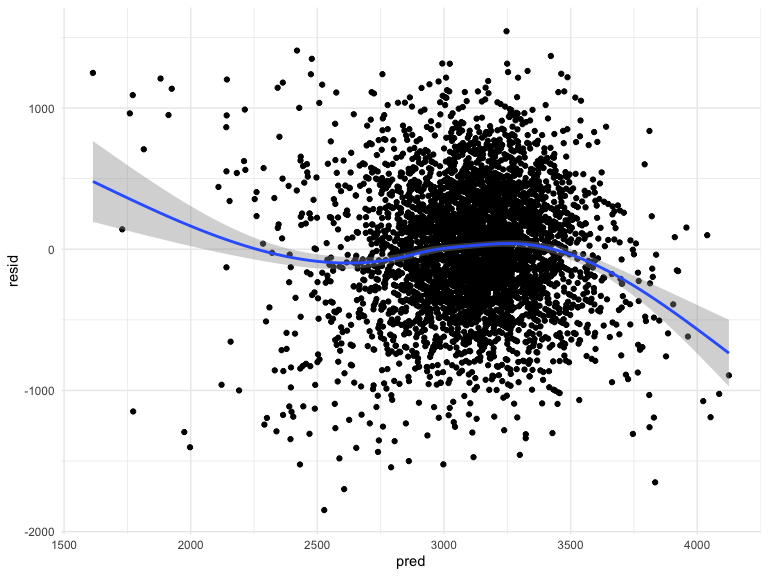
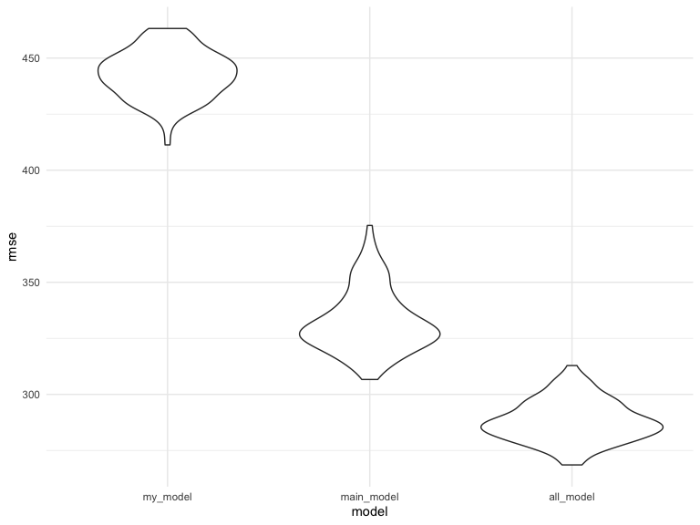
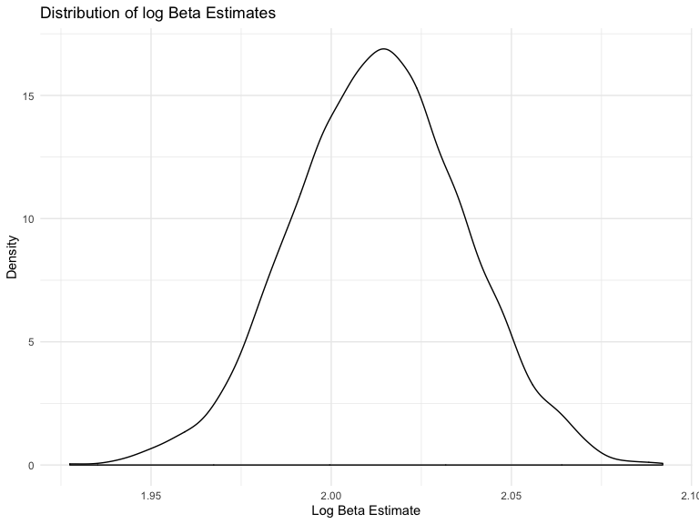
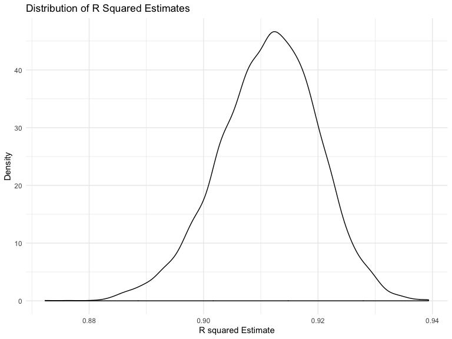

p8105\_hw6\_tb2715
================
Tess
11/16/2019

## Question 1

# Read and clean birthweight

``` r
birthweight_data = read_csv("./data/birthweight.csv")
```

    ## Parsed with column specification:
    ## cols(
    ##   .default = col_double()
    ## )

    ## See spec(...) for full column specifications.

``` r
birthweight_data %>%
  janitor:: clean_names() %>%
   mutate(
    babysex = as.factor(babysex),
    frace = as.factor(frace),
    malform = as.factor(malform),
    mrace = as.factor(mrace)
  )
```

    ## # A tibble: 4,342 x 20
    ##    babysex bhead blength   bwt delwt fincome frace gaweeks malform menarche
    ##    <fct>   <dbl>   <dbl> <dbl> <dbl>   <dbl> <fct>   <dbl> <fct>      <dbl>
    ##  1 2          34      51  3629   177      35 1        39.9 0             13
    ##  2 1          34      48  3062   156      65 2        25.9 0             14
    ##  3 2          36      50  3345   148      85 1        39.9 0             12
    ##  4 1          34      52  3062   157      55 1        40   0             14
    ##  5 2          34      52  3374   156       5 1        41.6 0             13
    ##  6 1          33      52  3374   129      55 1        40.7 0             12
    ##  7 2          33      46  2523   126      96 2        40.3 0             14
    ##  8 2          33      49  2778   140       5 1        37.4 0             12
    ##  9 1          36      52  3515   146      85 1        40.3 0             11
    ## 10 1          33      50  3459   169      75 2        40.7 0             12
    ## # … with 4,332 more rows, and 10 more variables: mheight <dbl>,
    ## #   momage <dbl>, mrace <fct>, parity <dbl>, pnumlbw <dbl>, pnumsga <dbl>,
    ## #   ppbmi <dbl>, ppwt <dbl>, smoken <dbl>, wtgain <dbl>

``` r
# create univariate linear model with family income
fincome_effect = lm(bwt ~ fincome, data = birthweight_data) 

fincome_effect %>%
  broom::tidy() %>%
  knitr::kable(digits = 2)
```

| term        | estimate | std.error | statistic | p.value |
| :---------- | -------: | --------: | --------: | ------: |
| (Intercept) |  2979.99 |     15.13 |    196.90 |       0 |
| fincome     |     3.05 |      0.30 |     10.31 |       0 |

In a simple, unadjusted linear regression model, family monthly income
(continuous variable) is a significant predictor of birthweight, such
that birthweight increases with increasing family monthly
income.

``` r
#examine if the relationship between income and birthweight is true when including covariates

adjusted_model = lm(bwt ~ fincome + delwt + gaweeks + menarche + malform + pnumlbw + mheight + ppbmi, data = birthweight_data) %>% 
  broom::tidy() %>% 
  knitr::kable(digits = 4)

adjusted_model  
```

| term        |  estimate | std.error | statistic | p.value |
| :---------- | --------: | --------: | --------: | ------: |
| (Intercept) |  468.2097 |  246.5043 |    1.8994 |  0.0576 |
| fincome     |    2.0031 |    0.2625 |    7.6297 |  0.0000 |
| delwt       |    9.1058 |    0.6209 |   14.6664 |  0.0000 |
| gaweeks     |   58.3454 |    2.1714 |   26.8698 |  0.0000 |
| menarche    |  \-4.4265 |    4.5992 |  \-0.9624 |  0.3359 |
| malform     | \-10.3672 |  114.5823 |  \-0.0905 |  0.9279 |
| mheight     |  \-4.8805 |    3.6127 |  \-1.3509 |  0.1768 |
| ppbmi       | \-32.5789 |    3.9397 |  \-8.2694 |  0.0000 |

After adjusting for covariates, the relationships remain significant,
except for when including the mother age, mother height, and
malformation variable. These variables will be removed for the final
linear
relationship.

``` r
my_adjusted_model = lm(bwt ~ fincome + delwt + gaweeks + pnumlbw + ppbmi, data = birthweight_data) 

my_adjusted_model  %>% 
  broom::tidy() %>% 
  knitr::kable(digits = 4)
```

| term        |  estimate | std.error | statistic | p.value |
| :---------- | --------: | --------: | --------: | ------: |
| (Intercept) |  104.7602 |   94.8444 |    1.1045 |  0.2694 |
| fincome     |    1.9628 |    0.2607 |    7.5302 |  0.0000 |
| delwt       |    8.5153 |    0.4421 |   19.2615 |  0.0000 |
| gaweeks     |   58.5441 |    2.1660 |   27.0284 |  0.0000 |
| ppbmi       | \-28.9609 |    3.0626 |  \-9.4562 |  0.0000 |

# Residual and Predictive model

``` r
residuals = 
  birthweight_data %>%
  add_residuals(my_adjusted_model)

predictive = 
  birthweight_data %>%
  add_predictions(my_adjusted_model)

all_bw_data = 
  merge(residuals, predictive)
```

``` r
all_bw_data %>%
  ggplot(aes(x = pred, y = resid)) + 
  geom_point() +
  geom_smooth()
```

    ## `geom_smooth()` using method = 'gam' and formula 'y ~ s(x, bs = "cs")'



The created model is not very useful. As the predictive model value
increases, the residual value tends to decrease. The covariates used in
the model would need to be investigated more thouroughly to try and
create a better model that is centered around 0.

# Compare across additional models

``` r
#create 2 comparison linear models
main_effects = lm(bwt ~ blength + gaweeks, data = birthweight_data) %>%
  broom::tidy()

main_effects
```

    ## # A tibble: 3 x 5
    ##   term        estimate std.error statistic  p.value
    ##   <chr>          <dbl>     <dbl>     <dbl>    <dbl>
    ## 1 (Intercept)  -4348.      98.0      -44.4 0.      
    ## 2 blength        129.       1.99      64.6 0.      
    ## 3 gaweeks         27.0      1.72      15.7 2.36e-54

``` r
all_effects = lm(bwt ~ bhead * blength * babysex, data = birthweight_data) %>%
  broom::tidy()

all_effects
```

    ## # A tibble: 8 x 5
    ##   term                   estimate std.error statistic     p.value
    ##   <chr>                     <dbl>     <dbl>     <dbl>       <dbl>
    ## 1 (Intercept)           -13552.     2759.       -4.91 0.000000939
    ## 2 bhead                    380.       83.4       4.56 0.00000528 
    ## 3 blength                  226.       57.4       3.94 0.0000843  
    ## 4 babysex                 6375.     1678.        3.80 0.000147   
    ## 5 bhead:blength             -4.43      1.72     -2.58 0.00981    
    ## 6 bhead:babysex           -198.       51.1      -3.88 0.000105   
    ## 7 blength:babysex         -124.       35.1      -3.52 0.000429   
    ## 8 bhead:blength:babysex      3.88      1.06      3.67 0.000245

# Use RMSE to evaluate prediction accuracy

``` r
cv_df = 
  crossv_mc(birthweight_data, 100)

cv_df =
  cv_df %>% 
  mutate(
    train = map(train, as_tibble),
    test = map(test, as_tibble))

cv_df = 
  cv_df %>% 
    mutate(my_adjusted_model = map(train, ~lm(bwt ~ fincome + delwt + gaweeks + pnumlbw + ppbmi, data = .x)), 
    main_effects = map(train, ~lm(bwt ~ blength + gaweeks, data = .x)),
    all_effects = map(train, ~lm(bwt ~ bhead * blength * babysex, data = .x))) %>% 
  mutate(
    rmse_my_model = map2_dbl(my_adjusted_model, test, ~rmse(model = .x, data = .y)),
    rmse_main_model = map2_dbl(main_effects, test, ~rmse(model = .x, data = .y)),
    rmse_all_model = map2_dbl(all_effects, test, ~rmse(model = .x, data = .y)))
```

# Plot RMSE values

``` r
cv_df %>% 
  select(starts_with("rmse")) %>% 
  pivot_longer(
    everything(),
    names_to = "model", 
    values_to = "rmse",
    names_prefix = "rmse_") %>% 
  mutate(model = fct_inorder(model)) %>% 
  ggplot(aes(x = model, y = rmse)) + geom_violin()
```



It appears that the best model is the model that accounts for head
circumference, length, sex, and all interactions amongst these 3
variables. This is not surprising, as all of these variables have to do
with the child itself. “my model” has the largest prediction model…
which is not surprising.

## Question 2

# Import weather data

``` r
weather_df = 
  rnoaa::meteo_pull_monitors(
    c("USW00094728"),
    var = c("PRCP", "TMIN", "TMAX"), 
    date_min = "2017-01-01",
    date_max = "2017-12-31") %>%
  mutate(
    name = recode(id, USW00094728 = "CentralPark_NY"),
    tmin = tmin / 10,
    tmax = tmax / 10) %>%
  select(name, id, everything())
```

    ## Registered S3 method overwritten by 'crul':
    ##   method                 from
    ##   as.character.form_file httr

    ## Registered S3 method overwritten by 'hoardr':
    ##   method           from
    ##   print.cache_info httr

    ## file path:          /Users/tessbloomquist/Library/Caches/rnoaa/ghcnd/USW00094728.dly

    ## file last updated:  2019-09-26 10:25:25

    ## file min/max dates: 1869-01-01 / 2019-09-30

# Create function to bootstrap

``` r
boot_sample = function(df) {
  sample_frac(df, replace = TRUE)
}
```

# Run bootstrep

``` r
boot_straps = 
  data_frame(
    strap_number = 1:5000,
    strap_sample = rerun(5000, boot_sample(weather_df))
  )

boot_straps
```

    ## # A tibble: 5,000 x 2
    ##    strap_number strap_sample      
    ##           <int> <list>            
    ##  1            1 <tibble [365 × 6]>
    ##  2            2 <tibble [365 × 6]>
    ##  3            3 <tibble [365 × 6]>
    ##  4            4 <tibble [365 × 6]>
    ##  5            5 <tibble [365 × 6]>
    ##  6            6 <tibble [365 × 6]>
    ##  7            7 <tibble [365 × 6]>
    ##  8            8 <tibble [365 × 6]>
    ##  9            9 <tibble [365 × 6]>
    ## 10           10 <tibble [365 × 6]>
    ## # … with 4,990 more rows

# Create variables for analysis

``` r
bootstrap_rsquared = 
  boot_straps %>% 
  mutate(
    models = map(strap_sample, ~lm(tmax ~ tmin, data = .x)),
    rsquared = map(models, broom:: glance)) %>% 
  select(-strap_sample, -models) %>% 
  unnest() %>%
  select(strap_number, r.squared)

bootstrap_beta = 
  boot_straps %>% 
  mutate(
    models = map(strap_sample, ~lm(tmax ~ tmin, data = .x)),
    results = map(models, broom::tidy)) %>% 
  select(-strap_sample, -models) %>% 
  unnest() %>%
  select(-std.error, -statistic, -p.value) %>%
  pivot_wider(
    names_from = term,
    values_from = estimate
  ) %>% 
  rename(beta1 = tmin, beta0 = `(Intercept)`) %>% 
  mutate(log = log(beta0*beta1))
```

# Plots of boot straps and density plots(beta log)

``` r
beta_plot = bootstrap_beta %>%
  ggplot(aes(x = log)) +
  geom_density() +
  labs(
    x = "Log Beta Estimate",
    y = "Density",
    title = "Distribution of log Beta Estimates"
    )

beta_plot
```


The distribution of estimates for the log value has a fairly normal
distribution with a small divot at the very top of the peak. There is
also a larger tail towards the lower values than higher values which
could indicate that large outliers are excluded from the bootstrap more
than smaller outliers.

# Plots of boot straps and density plots (rsquared)

``` r
r_plot = bootstrap_rsquared %>%
  ggplot(aes(x = r.squared)) +
  geom_density() +
  labs(
    x = "R squared Estimate",
    y = "Density",
    title = "Distribution of R Squared Estimates"
    )

r_plot
```


The distribution of estimates for r squared value has a fairly normal
distribution with a larger tail towards the lower values than higher
values. THis could indicate that large outliers are excluded from the
bootstrap more than smaller outliers.

# Determining 95% CI

``` r
quantile(pull(bootstrap_beta, log), probs =c(0.025, 0.975))
```

    ##     2.5%    97.5% 
    ## 1.966500 2.059981

``` r
quantile(pull(bootstrap_rsquared, r.squared), probs =c(0.025, 0.975))
```

    ##      2.5%     97.5% 
    ## 0.8931591 0.9274071

The 95% CI for the log estimates ranges from 1.96-2.05.

The 95% CI for the rsquared estimates ranges from 0.89-0.93.
